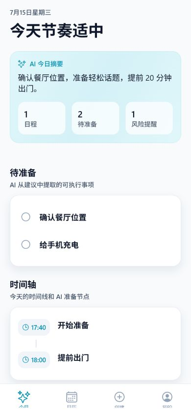
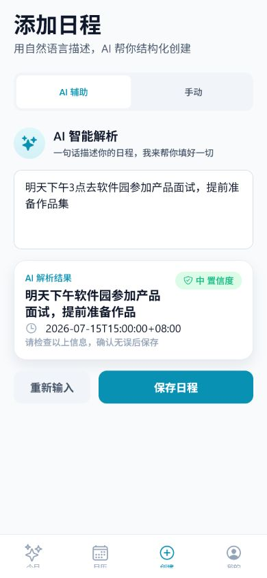
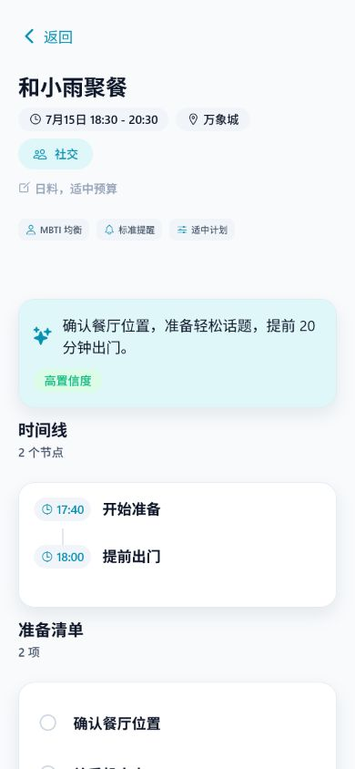
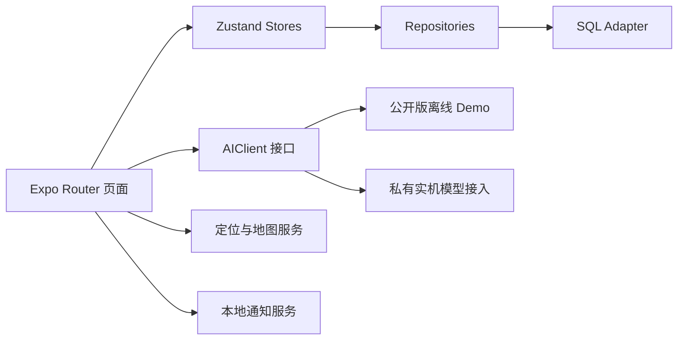

# AI 日程助手

把一句模糊的生活安排，转化为可确认的日程和可执行的准备方案。

这是一个使用 Expo + React Native 开发的 Android/iOS 跨端作品。项目同时展示产品需求拆解、AI 交互设计、移动端工程实现、自动化测试与 Android 交付流程。

## 产品演示

| 今日行动总览 | AI 自然语言创建 |
| --- | --- |
|  |  |
| 行动方案 | 日历闭环 |
|  |  |

实机视频从已经安装的真实模型接入版本录制，并随 `v0.1.0` Release 一起提供。公开视频展示自然语言输入、结构化确认、行动方案、路线/提醒上下文和日历回看。

Android 体验包：在仓库的 **Releases** 页面下载 `AI-Schedule-Assistant-v0.1.0.apk`。

## 为什么做这个产品

普通日历回答“什么时候提醒”，但面试、聚餐、运动和办事等场景还需要回答：

- 我应该提前准备什么？
- 什么时候出发更合适？
- 哪些风险容易遗漏？
- 怎样把建议变成可以逐项执行的行动？

因此 v0.1.0 只聚焦一条闭环：**描述安排 -> AI 结构化 -> 用户确认 -> 生成行动方案 -> 日历回看**。

详细产品分析见 [产品案例](docs/product/product-case.md)。

## 核心能力

- 自然语言解析日程，并在保存前提供结构化确认。
- 手动创建日程，作为 AI 失败时的可靠降级路径。
- 按日程类型生成时间线、准备清单、风险与个性化建议。
- 日历、今日页、创建页、详情页和偏好页组成完整移动端流程。
- 地图定位、路线规划和本地通知服务已建立独立服务边界。
- AI Client、Store、Repository 和 SQL Adapter 分层，可独立替换与测试。
- 13 个 Jest 测试套件、41 个测试用例和 TypeScript 静态检查构成发布质量门。

## 产品取舍

| 决策 | 原因 |
| --- | --- |
| AI 不能直接创建日程 | 用户必须确认时间、地点和意图，避免模型错误直接写入数据。 |
| 同时保留手动创建 | 保证网络或模型不可用时，基础日程功能仍然可用。 |
| 建议使用结构化卡片 | 时间线、清单和风险比长段聊天文本更容易执行。 |
| v0.1.0 不做账号和协作 | 先验证单用户高频闭环，避免非核心后端复杂度。 |
| 公开包默认离线 Demo | 任何评审者都能稳定体验，同时不向移动端分发 API 密钥。 |

## 工程架构



当前公开演示使用内存 SQL Adapter，确保无账号、无服务配置也能完整体验；它不会在 App 重启后保留数据。Repository 与 schema 已独立，生产版本应接入设备数据库适配器并增加迁移测试。

详细设计与限制见 [工程说明](docs/engineering/architecture.md)。

## AI 与安全边界

公开仓库和公开 APK 不包含 DeepSeek、高德或其他服务密钥。未提供本地配置时，应用自动使用确定性的离线 AI Demo。

`.env.example` 仅用于私有本地调试。`EXPO_PUBLIC_*` 会被编译进客户端，不能用于保存生产密钥；正式产品必须通过服务端代理完成鉴权、限流、审计和密钥轮换。

## Vibe Coding 工作流

项目使用 AI 原生协作完成需求拆解、方案比较、页面实现、测试诊断和发布检查。AI 负责加速探索与重复劳动，人工对以下结果负责：

1. 明确用户问题、核心闭环与非目标。
2. 审核模型生成的数据结构和工程边界。
3. 用失败测试定位问题，而不是直接接受生成代码。
4. 清理客户端凭据并建立公开发布安全边界。
5. 以测试、类型检查、APK 元数据和校验值作为完成标准。

需求与执行过程保存在 `docs/superpowers/specs/` 和 `docs/superpowers/plans/`，便于复盘 AI 协作中的决策过程。

## 本地运行

环境要求：Node.js、npm，以及运行 Android/iOS 所需的 Expo 工具链。

```powershell
npm.cmd install
npm.cmd start
```

常用命令：

```powershell
npm.cmd test -- --runInBand
npm.cmd run typecheck
npm.cmd run android
npm.cmd run ios
```

Windows 无法直接完成原生 iOS 构建；`npm.cmd run ios` 需要 macOS/Xcode 或云构建环境。

## 验证结果

| 检查 | 当前结果 |
| --- | --- |
| Jest | 13/13 suites，41/41 tests 通过 |
| TypeScript | `tsc --noEmit` 通过 |
| Android | v0.1.0 Release APK |
| iOS | 共用 React Native 代码路径，尚未提供安装包 |

## 已知限制

- 公开 APK 使用离线 AI Demo；真实模型效果通过实机录屏展示。
- 当前公开演示的数据在 App 重启后重置。
- 地图 Web API 需要私有本地配置，公开包不携带地图密钥。
- 本版本没有账号、云同步、多人协作或系统日历双向同步。
- Android APK 是作品评估包，不代表已经上架应用商店。

## 更多材料

- [产品案例与用户研究 Demo](docs/product/product-case.md)
- [工程架构与技术取舍](docs/engineering/architecture.md)
- [v0.1.0 发布说明](docs/release/v0.1.0.md)
- [完整产品设计](docs/superpowers/specs/2026-07-14-ai-schedule-assistant-product-design.md)

