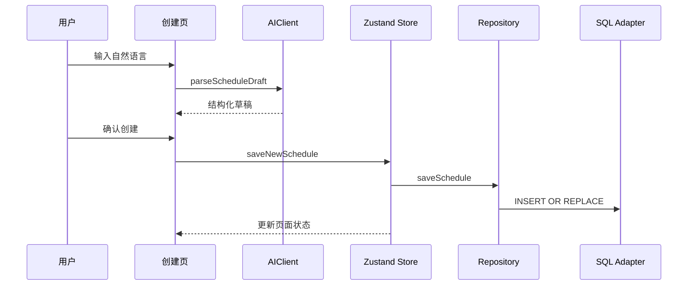

# 工程架构与技术取舍

## 1. 技术目标

v0.1.0 的工程目标是用一套 React Native 代码承载 Android/iOS 页面逻辑，让 AI、地图、通知和数据层可以独立替换，并用自动化测试验证关键边界。

## 2. 模块边界

```text
app/                       Expo Router 路由入口
src/features/              按页面与用户流程组织的功能模块
src/components/common/     通用移动端组件
src/stores/                Zustand 状态与依赖注入
src/services/ai/           AIClient、Mock 与模型客户端
src/services/map/          定位、地理编码、POI、天气与路线
src/services/notification/ 提醒计算与本地通知调度
src/services/storage/      SQL schema、Adapter 与 Repository
src/types/                 日程、方案与偏好领域类型
```

页面不直接调用 SQL，也不依赖具体模型厂商。`StoreProvider` 负责注入 Repository 与 AIClient，页面通过稳定的 hooks 读取状态和调用动作。

## 3. 数据流



## 4. AI Provider 设计

`AIClient` 暴露两个核心能力：解析日程草稿和生成行动方案。页面只依赖接口：

- `mockAIClient` 提供确定性离线响应，用于公开 APK 与自动化测试。
- `openaiClient` 通过兼容接口连接模型服务，用于私有实机演示。
- `getAIClient` 根据本地配置选择实现，没有配置时自动降级。

这个设计保证公开体验稳定，但不把 Mock 描述为真实在线模型。

## 5. 数据层现状

Repository 使用 SQL 风格接口，schema 包含 `schedules`、`ai_plans` 和 `preferences`。Jest 通过内存 Adapter 验证 Repository 和 Store 行为。

当前公开运行时也使用内存 Adapter，因此数据只在单次 App 会话中存在。这是作品版的明确限制。接入真正设备持久化时，应实现基于 `expo-sqlite` 的 Adapter，并补充数据库迁移、损坏恢复和跨版本升级测试。

## 6. 地图与通知

地图模块将定位、地理编码、周边搜索、天气和路线规划拆成独立函数。公开包不携带地图 Key，相关能力需要私有本地配置。

通知模块将提醒时间计算与 Expo 本地通知调度分开。纯计算逻辑可以在 Jest 中确定性验证，设备权限与系统弹窗由实机演示验证。

## 7. 安全边界

移动应用包可以被解包，因此环境变量不能保护已经编译进客户端的服务密钥。公开版本遵循以下约束：

- Git 和 APK 中不保存真实服务密钥。
- 无配置时使用离线 Demo，不让评审流程依赖外部服务。
- `.env.example` 只说明私有调试变量，不承诺安全存储。
- 生产方案应增加服务端代理、用户鉴权、限流、调用审计和密钥轮换。

## 8. 测试策略

| 层级 | 覆盖内容 |
| --- | --- |
| 领域/服务 | 提醒计算、SQL schema 与 Repository 行为 |
| Store | 加载、创建、详情、清单切换和偏好更新 |
| 组件 | 通用组件的可访问性与交互契约 |
| 页面 | 今日空状态、日历数据、创建模式与偏好持久化 |
| 配置 | Hermes、新架构、图标、启动图和凭据扫描 |

当前质量门：13 个测试套件、41 个测试用例，以及 `tsc --noEmit`。

## 9. 已知工程债务

- 运行时尚未连接设备 SQLite Adapter。
- iOS 共用代码尚未在 macOS/Xcode 或 TestFlight 验证。
- 公开包没有线上模型和地图服务。
- 大型页面组件仍可继续拆分，但本次发布不做无关重构。
- 生产环境还需要崩溃监控、性能指标、CI 和发布签名管理。

